# Top 25 Best Graphic Design Platforms in 2025

Finding the right designer used to mean spending weeks sorting through portfolios, negotiating rates, and hoping your hire would actually understand your vision. Now the entire creative industry has shifted online, with platforms connecting businesses to talented designers faster than you can sketch a wireframe on a napkin. Whether you need a logo by Tuesday or a complete rebrand by month's end, these design platforms offer everything from crowdsourced contests to dedicated designer subscriptions, making professional creative work accessible at practically any budget or timeline.

***

## **[99designs](https://99designs.com)**

The global leader in crowdsourced design where your project becomes a creative competition attracting dozens of designer submissions.

99designs pioneered the design contest model back in 2008, building a community of over one million designers worldwide who compete to win your project. When you launch a contest, you write a brief describing exactly what you need, select a package tier, and watch design concepts roll in from multiple designers. You provide feedback, request revisions, and ultimately choose one winning design while only paying for that final selection.

The platform covers virtually every design category imaginable, from logos and brand identity to web design, packaging, book covers, and merchandise. Their four pricing tiers range from Bronze at $299 to Platinum around $1,300, with higher packages attracting more experienced designers and including project management support. Every package includes a 60-day money-back guarantee and full copyright ownership of your final design.

Beyond contests, 99designs offers direct hiring where you browse designer portfolios and collaborate one-on-one, plus a pre-made design store for ready-to-customize options that get removed from sale once you purchase them to maintain uniqueness. The platform's intuitive design posting process helps you present clear briefs so designers understand exactly what you need, producing better results faster.

***

## **[DesignCrowd](https://www.designcrowd.com)**

Another major crowdsourcing platform connecting you with designers globally through competitive contests at accessible price points.

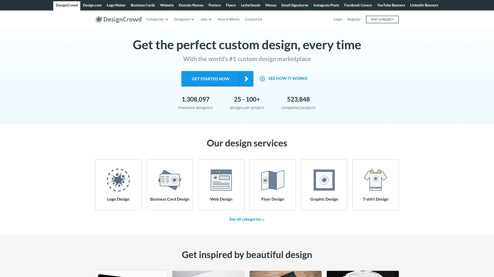

DesignCrowd operates similarly to 99designs but positions itself as a budget-friendly alternative without sacrificing quality. You can run contests across numerous design categories, and the platform awards prize money to the top three submissions, with the winner receiving the largest sum. This multi-winner approach encourages more designers to participate and submit their best work.

The platform doesn't offer fixed pricing packages but instead customizes quotes based on your specific project type and category requirements. Designer profiles include detailed filters like specialty, country, earnings history, percentage of jobs awarded, and performance ratings, making it easier to identify top talent. With a verified designer community spanning 52 countries, DesignCrowd delivers diverse creative perspectives for businesses seeking fresh visual identities.

***

## **[Designhill](https://www.designhill.com)**

A comprehensive creative marketplace hosting over 330,000 verified designers across 50 service categories with exceptional client satisfaction rates.

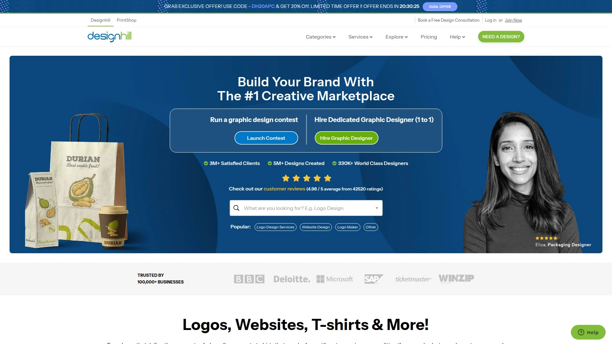

Designhill has created over 10 million designs since launch, establishing itself as a one-stop destination for businesses worldwide exploring design services. The platform maintains a 99% client satisfaction rate by carefully vetting designers before they join the network. You can launch design contests similar to other platforms or browse designer portfolios to hire directly for custom projects.

The marketplace covers everything from digital business cards and brochures to posters and complete branding packages. Designhill's strength lies in its massive designer network spread across 52 countries, giving you access to creative talent with vastly different cultural perspectives and design aesthetics. The platform emphasizes quality and affordability, making professional design accessible to entrepreneurs and small businesses operating on tight budgets.

***

## **[Crowdspring](https://www.crowdspring.com)**

An established design and naming platform where creative projects benefit from crowdsourced ideas and collaboration.

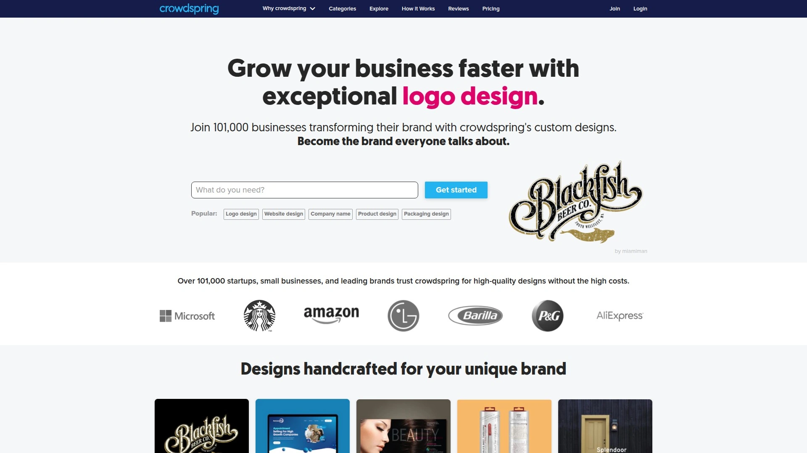

Crowdspring extends beyond visual design to include naming services, product design, and comprehensive branding solutions. The platform has facilitated thousands of successful projects since its founding, building a reputation for quality work and professional service. Like other contest-based platforms, you create a brief, set your budget, and receive multiple design concepts from competing creatives.

Designers on Crowdspring range from emerging talents to seasoned professionals, giving you variety in both style and pricing. The platform emphasizes communication between clients and designers throughout the contest period, allowing for iterative improvements based on your feedback. Crowdspring also provides project management tools to organize submissions, track revisions, and make final selections efficiently.

***

## **[Fiverr](https://www.fiverr.com)**

The massive gig-based marketplace where graphic designers offer specific services starting at accessible price points for quick turnarounds.

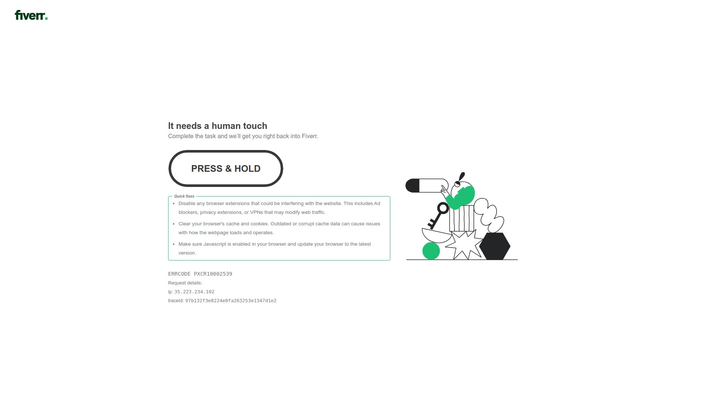

Founded in 2010, Fiverr revolutionized freelancing with its gig model where designers create specific service offerings that clients browse and purchase directly. Graphic designers on Fiverr offer everything from logo creation to social media graphics, presentation design, and custom illustrations. You can create multiple gigs, each tailored to different design specialties, making it simple to find exactly the service you need.

Fiverr charges a flat 20% service fee on transactions, keeping pricing transparent with no hidden costs. The platform works especially well for small, well-defined projects where you know exactly what deliverable you want. Designer profiles showcase portfolios, client testimonials, and ratings, helping you evaluate quality before placing orders. Communication happens directly through Fiverr's messaging system with clear guidelines for project expectations and delivery timelines.

***

## **[Upwork](https://www.upwork.com)**

A proposal-based freelance platform facilitating both hourly and fixed-price graphic design contracts for projects of any scale.

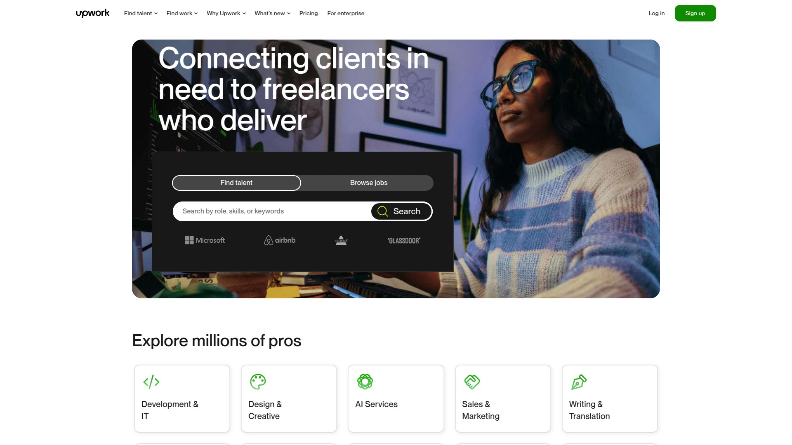

Established in 2015, Upwork connects businesses with freelancers through job listings where designers submit proposals outlining their approach, timeline, and pricing. This proposal system allows designers to showcase expertise and negotiate terms before projects begin, often leading to more tailored client interactions and substantial ongoing work. The platform suits complex projects like branding overhauls, website design, and long-term design support better than quick one-off tasks.

Upwork's tiered fee structure starts at 20% for the first $500 earned with a client, decreasing to 10% for earnings between $500 and $10,000, then 5% above that threshold. This structure rewards long-term client relationships, making fees progressively lower as your working relationship deepens. Designer profiles include extensive portfolios, work history, skill tests, and client feedback ratings that significantly impact reputation and future project acquisition.

***

## **[Design Pickle](https://designpickle.com)**

An unlimited graphic design subscription service providing consistent creative support through dedicated designers at flat monthly rates.

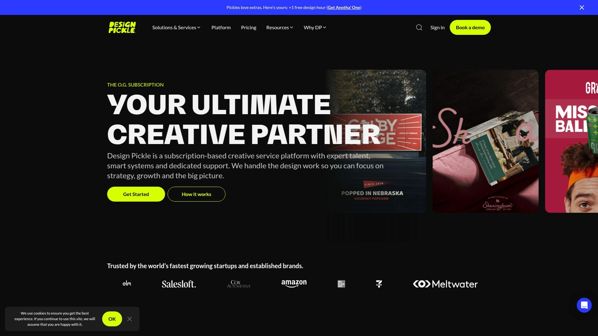

Design Pickle eliminates the need to source and manage freelance designers by offering unlimited design requests for a predictable monthly fee starting at $499. When you subscribe, you're assigned a personal designer who works exclusively on your projects, developing deep understanding of your brand style and requirements over time. This dedicated relationship produces consistent design quality and reduces briefing time on new projects.

The service excels at high-volume design needs with quick turnarounds, offering same-day concept delivery for Pro subscribers and first concepts within 1-2 business days for standard plans. Design Pickle provides diverse creative work including motion graphics, cartoon art, portraits, realistic illustrations, and even tattoo designs. The platform includes collaboration tools with a centralized space where internal teams can review, discuss, and approve designs together, streamlining feedback processes.

***

## **[Penji](https://penji.co)**

Another unlimited design subscription platform connecting businesses with professional designers for ongoing creative projects without per-project fees.

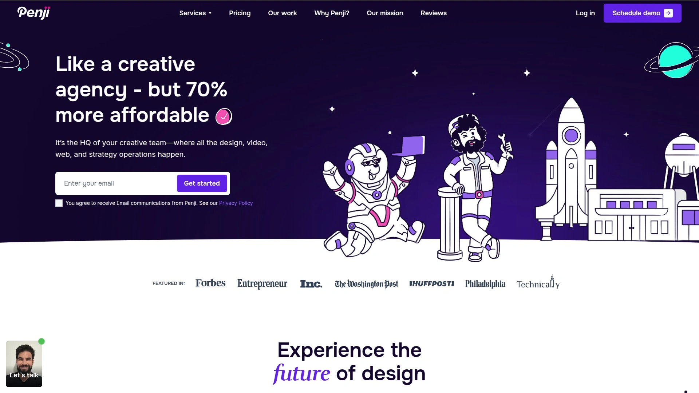

Penji operates on a similar subscription model to Design Pickle but positions itself as offering broader service ranges and faster turnarounds for certain project types. You submit unlimited design requests through their platform, receiving professional work without worrying about hourly rates or project-by-project negotiations. The service works best for businesses with consistent design needs spanning multiple categories.

Penji designers handle everything from social media graphics and marketing materials to web design elements and presentation decks. The platform emphasizes quick revisions and responsive communication, understanding that marketing teams often work under tight deadlines. Subscription pricing remains flat regardless of request volume, making costs predictable for budgeting purposes while encouraging you to maximize the service value through frequent use.

***

## **[Designbro](https://www.designbro.com)**

A crowdsourcing platform featuring expert designers competing in contests at competitive prices with guaranteed quality standards.

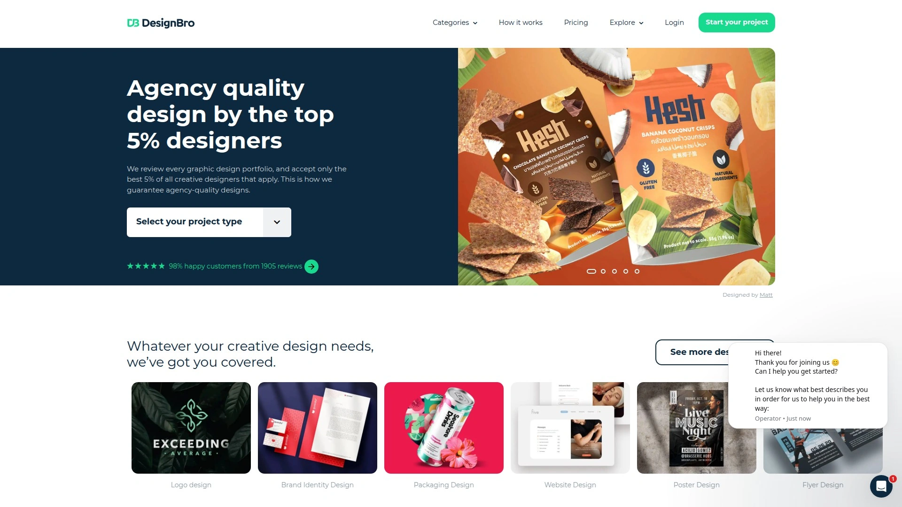

Designbro supports a curated community of professional designers, positioning itself as a quality-focused alternative to larger contest platforms. You'll find only vetted professional designers on this platform, ensuring submissions meet high creative standards. Designbro's pricing tends to fall below 99designs while maintaining professional output, making it attractive for businesses seeking value without compromising quality.

The platform awards prize money to the top three designs in each contest, with the winner receiving the largest payout. This multi-winner approach motivates designers to submit thoughtful, polished work rather than rushing quantity over quality. However, Designbro focuses exclusively on contests without offering one-on-one project options or blind contest formats that some other platforms provide.

***

## **[Hatchwise](https://www.hatchwise.com)**

An unlimited graphic design contest platform specializing in logos, branding, and creative competitions with straightforward pricing.

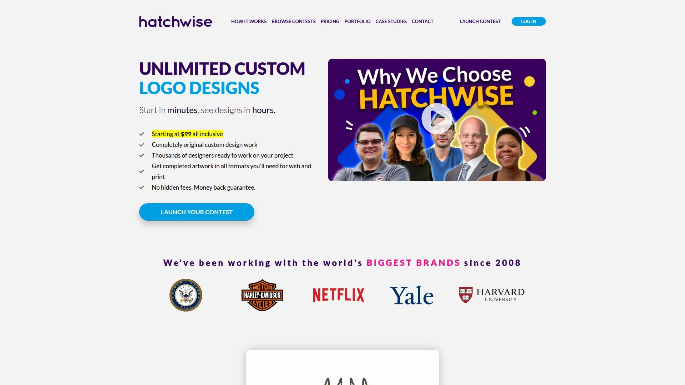

Hatchwise combines the contest model with unlimited design benefits, allowing you to crowdsource design and branding projects while paying only for designs you love. The platform walks you through step-by-step processes to ensure you get the right designs from suitable designers. Hatchwise particularly excels at logo design contests where multiple creative directions emerge quickly.

The platform maintains a clean, user-friendly interface that makes launching contests and managing submissions intuitive even for first-time users. Hatchwise also provides resources and guides helping clients write effective design briefs that attract quality submissions. Their pricing structure remains competitive within the contest platform space, offering various package tiers based on expected designer participation and expertise levels.

***

## **[DesignContest](https://www.designcontest.com)**

An established design competition platform inspiring unique creative solutions through structured contests across multiple categories.

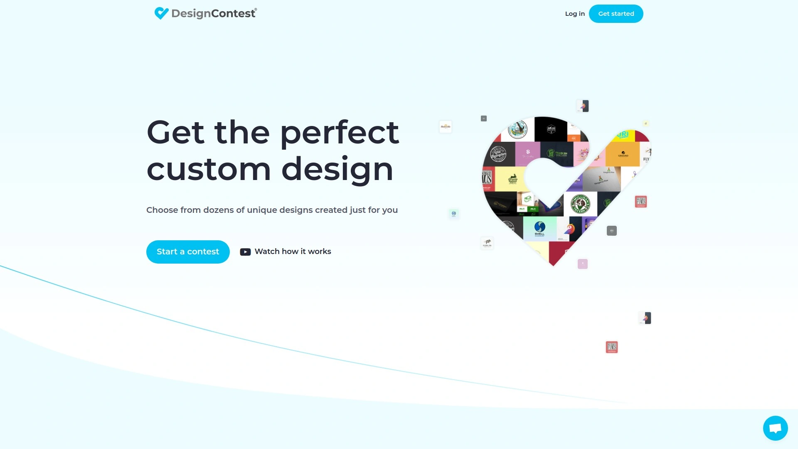

Operating since 2002, DesignContest brings decades of experience facilitating successful design projects between clients and creative professionals. The platform's longevity demonstrates its reliability and effectiveness in the crowdsourced design space. You can launch contests for logos, websites, business cards, and virtually any design category while setting parameters that attract designers matching your style preferences.

DesignContest emphasizes unique, custom designs rather than template-based work, encouraging designers to create original concepts specifically for your project. The structured contest format includes clear timelines, feedback mechanisms, and selection processes that keep projects moving toward completion. Designers compete knowing that strong portfolio work from winning contests helps attract future clients on and off the platform.

***

## **[Brandsupply](https://brandsupply.com)**

An online marketplace offering design contests and pre-made creative assets with focus on logos, illustrations, and digital art.

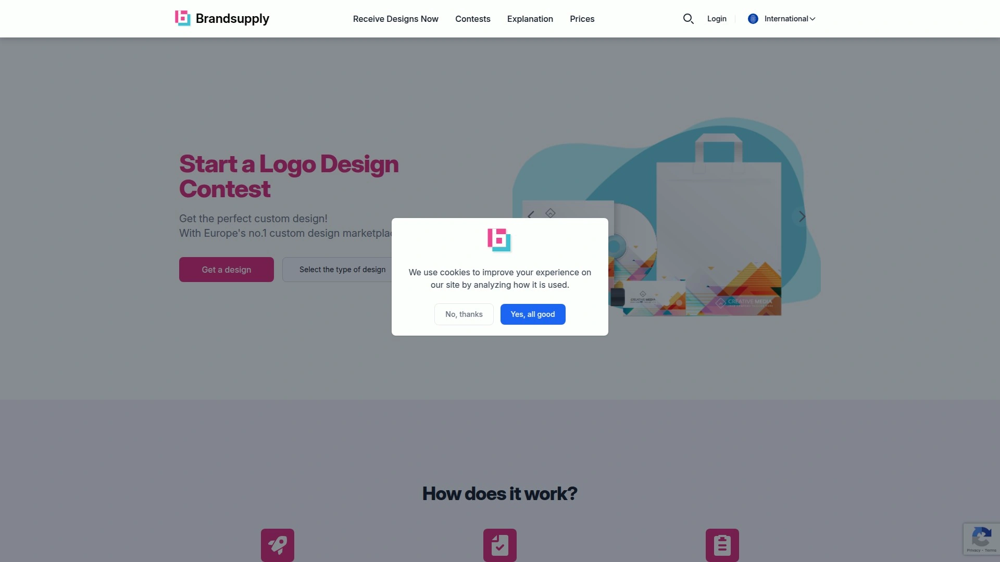

Brandsupply provides two main pathways: launching custom design contests or purchasing from their marketplace of existing creative work. When running contests, you can request designs across categories including stationery, promotional items, and branding materials. The platform allows feedback on every submission with revision requests, ensuring final designs meet your specifications.

The marketplace side offers ready-made logos, illustrations, and digital art pieces that you can purchase and customize for immediate use. This dual approach works well when you need something quickly but still want customization options. Brandsupply's designer community includes specialists in various creative niches, from corporate branding to playful consumer product designs.

***

## **[Dribbble](https://dribbble.com)**

A premier creative showcase platform where top designers share portfolios and connect with clients seeking exceptional talent.

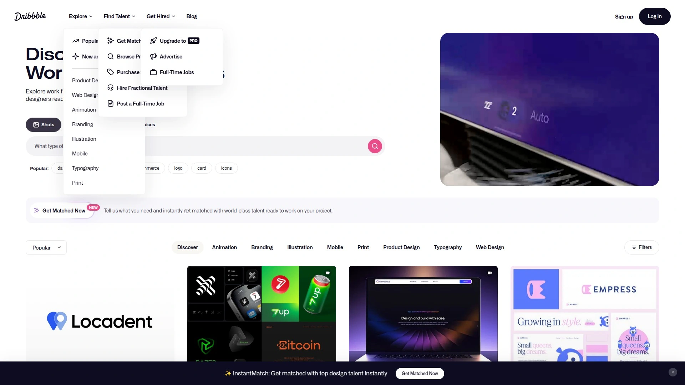

Dribbble started as a portfolio platform where designers share snapshots of their work, evolving into a hiring marketplace connecting businesses with elite creative professionals. The platform attracts some of the design industry's most talented individuals who use it to showcase skills and attract freelance opportunities. Unlike contest platforms, Dribbble focuses on direct hiring based on portfolio strength.

You can browse designer profiles filtered by specialty, location, availability, and style preferences. Dribbble's community emphasizes high-quality, polished work, making it ideal when you need designers with proven track records and distinctive aesthetic sensibilities. The platform includes job boards where you post openings and designers apply, plus direct messaging for reaching out to specific talents whose portfolios catch your attention.

***

## **[Behance](https://www.behance.net)**

Adobe's portfolio platform showcasing creative work from designers, illustrators, and artists worldwide with integrated hiring features.

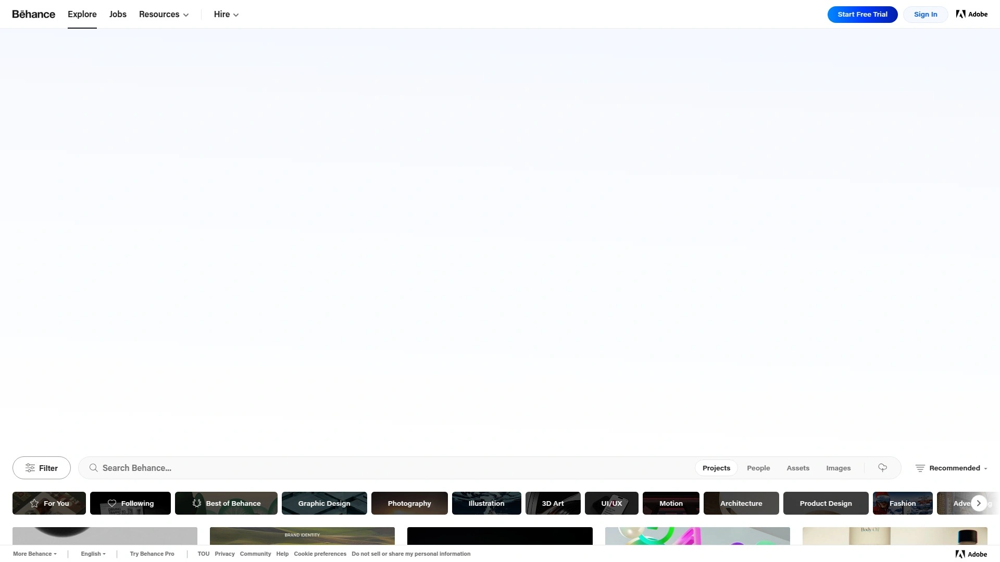

Behance serves as both portfolio showcase and job marketplace, hosting creative professionals across design disciplines. The platform's integration with Adobe Creative Cloud means many designers maintain active, updated portfolios here as part of their creative workflow. You can explore detailed project case studies showing designers' processes, thinking, and final outcomes beyond simple finished work samples.

The job listing feature lets you post creative opportunities that reach Behance's global designer community. Profiles typically include more comprehensive project documentation than quick-shot portfolio sites, giving deeper insight into how designers approach problems and develop solutions. Behance works particularly well when seeking designers for longer-term projects where process compatibility matters as much as aesthetic fit.

***

## **[Toptal](https://www.toptal.com)**

An exclusive network connecting businesses with the top 3% of freelance designers through rigorous vetting and matching processes.

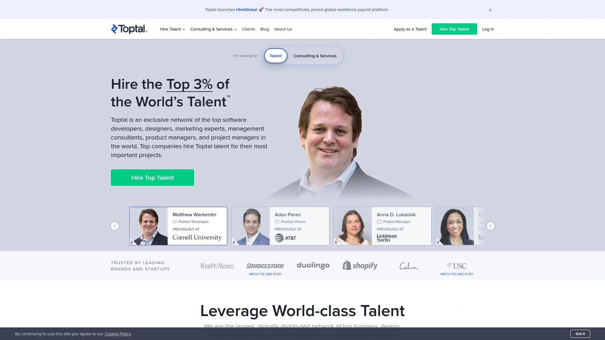

Toptal positions itself as the premium option for businesses requiring exceptional design talent. The platform screens designers through intensive evaluation before accepting them into the network, ensuring only elite professionals gain access. This selectivity means higher rates but also higher quality and reliability than open marketplaces.

Every engagement begins with a no-risk trial period up to two weeks, letting you confirm the match works before committing financially. If unsatisfied, Toptal provides another designer better suited to your needs with a second trial period. The platform handles designer sourcing, vetting, and matching within 48 hours for most projects, saving significant time in the hiring process. Toptal works best for complex projects requiring specialized expertise or cross-functional teams combining design with development and product management skills.

***

## **[Looka](https://looka.com)**

An AI-powered logo maker creating hundreds of custom design options instantly based on your preferences and brand information.

Looka uses artificial intelligence to generate logo concepts after you input your company name, industry, and style preferences. Within minutes, you're browsing hundreds of unique options tailored to your specifications. The platform's editor lets you adjust colors, fonts, layouts, and symbols until achieving your perfect design.

Looka's download package includes everything a traditional designer would deliver: high-resolution PNG and JPG files, scalable vector formats (SVG and EPS), color variations, transparent backgrounds, business card designs, social media templates, and brand guidelines documenting your fonts and colors. Unlike traditional contest platforms requiring days or weeks, Looka delivers complete brand assets within hours at significantly lower costs starting around $20 for basic packages. The platform also offers unlimited post-purchase changes through Brand Kit subscriptions and lifetime logo support for technical assistance.

***

## **[BrandCrowd](https://www.brandcrowd.com)**

An AI-driven logo generator with over 176,000 designer-created templates customizable for immediate download and use.

BrandCrowd's vast template library provides starting points for virtually any industry or style preference. The AI system recommends designs based on your business type and aesthetic selections, showing relevant options quickly. You customize chosen templates by adjusting colors, fonts, icons, and layouts through an intuitive editor before downloading final files.

The platform delivers all necessary file formats at reasonable prices, making professional branding accessible to startups and small businesses. BrandCrowd works particularly well when you need a logo quickly but want more customization than fully automated generators provide. The templates come from actual designers, ensuring quality and style diversity beyond what pure AI generation produces.

***

## **[Tailor Brands](https://www.tailorbrands.com)**

An AI logo maker and brand building platform creating unique identities through automated design processes.

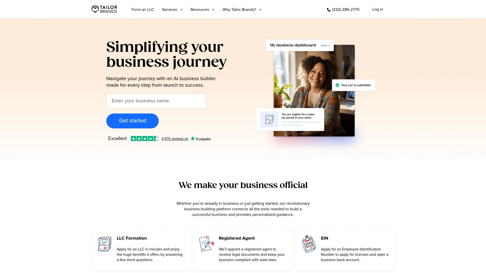

Tailor Brands uses artificial intelligence to generate custom logo designs based on your inputs about business name, industry, and visual preferences. The platform goes beyond simple logo creation to help build complete brand identities including color palettes, typography systems, and usage guidelines. You receive multiple design directions to choose from, then customize your favorite through their editor.

The service includes marketing materials and brand assets beyond just the logo itself, providing templates for business cards, social media profiles, and other branded touchpoints. Tailor Brands targets entrepreneurs and small businesses needing complete brand packages quickly without hiring multiple designers or agencies. The automated approach keeps costs significantly below traditional design services while delivering professional-looking results.

***

## **[LogoNerds](https://www.logonerds.com)**

An affordable logo design service providing custom creative work through dedicated designer relationships at accessible price points.

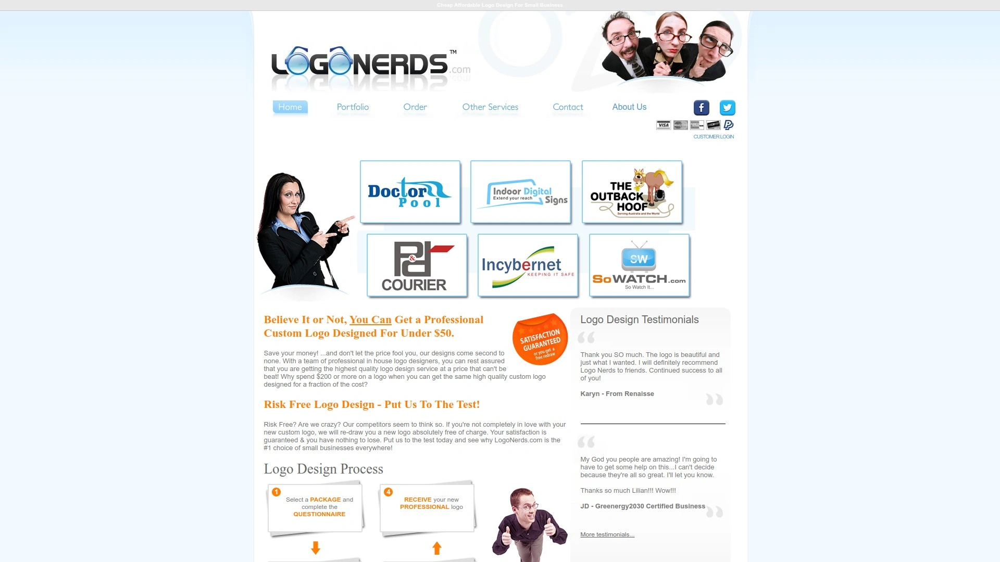

Operating since 2006, LogoNerds has built a reputation for quality logo design at budget-friendly rates. Unlike contest platforms, you work directly with an assigned designer who develops concepts specifically for your brand. This one-on-one collaboration allows for deeper communication about vision, values, and aesthetic preferences than contest formats permit.

The service focuses specifically on logo design rather than trying to cover every creative category, developing deep expertise in brand identity fundamentals. LogoNerds delivers multiple initial concepts, then refines your chosen direction through revision rounds until achieving the perfect final mark. Their pricing remains considerably lower than large contest platforms while maintaining professional quality through experienced designers.

***

## **[CAD Crowd](https://www.cadcrowd.com)**

A specialized crowdsourcing platform for 3D design, CAD modeling, and technical product design through contest and direct hire formats.

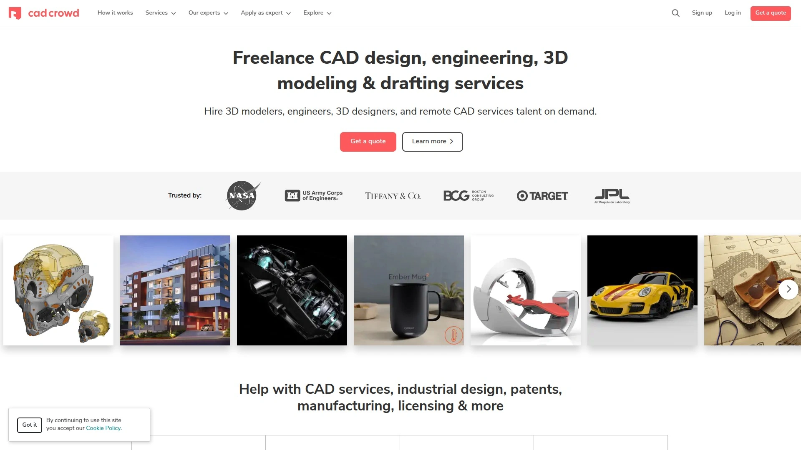

CAD Crowd serves businesses needing 3D modeling, product design, and technical drafting beyond typical graphic design. You can run contests for design challenges or hire CAD specialists directly for projects requiring engineering precision. The platform attracts professionals skilled in Computer-Aided Design software, 3D printing preparation, and manufacturing-ready technical drawings.

After running contests, you can hire winning designers for ongoing work at hourly rates, transitioning from competition to collaboration. This flexibility works well for product development projects that begin with concept exploration then move into detailed technical execution. CAD Crowd fills a niche that general graphic design platforms don't adequately serve, connecting engineers and product developers with specialized technical creatives.

***

## **[Creative Market](https://creativemarket.com)**

A designer-focused marketplace for selling and purchasing templates, fonts, graphics, branding kits, and digital design assets.

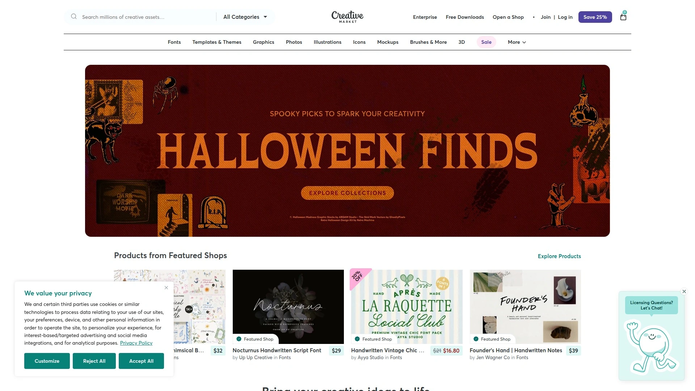

Creative Market lets designers earn passive income by creating and selling digital products including PowerPoint templates, icon sets, font families, and mockups. As a buyer, you access thousands of professional design assets at individual purchase prices without subscription requirements. You set your own usage of purchased assets, though checking licensing terms for commercial projects remains important.

The marketplace attracts a design-savvy audience seeking high-quality resources for their own creative work. Creative Market charges designers a 30% fee on sales but doesn't require exclusivity, allowing creators to sell the same assets elsewhere. The platform works best when you need specific design elements like fonts, textures, or templates rather than fully custom work, providing professional resources at lower costs than commissioning original designs.

***

## **[Envato Market / GraphicRiver](https://graphicriver.net)**

A massive digital marketplace offering downloadable design assets including templates, graphics, vectors, and creative resources.

Envato Market encompasses multiple specialized marketplaces including GraphicRiver for graphics, ThemeForest for website themes, and AudioJungle for music. GraphicRiver specifically provides logos, flyers, resumes, illustrations, icons, web elements, and templates across numerous categories. The platform's enormous library means you can find design assets for virtually any project type or industry.

Envato operates on a pay-per-download model where you purchase individual items at set prices, plus subscription options through Envato Elements for unlimited downloads. The marketplace attracts professional designers selling their work globally, creating fierce competition that drives quality upward. While you're buying existing designs rather than custom work, the vast selection often includes templates close enough to your needs that minor customization produces professional results quickly.

***

## **[Gigster](https://gigster.com)**

A premium software development platform including design services as part of comprehensive tech project teams.

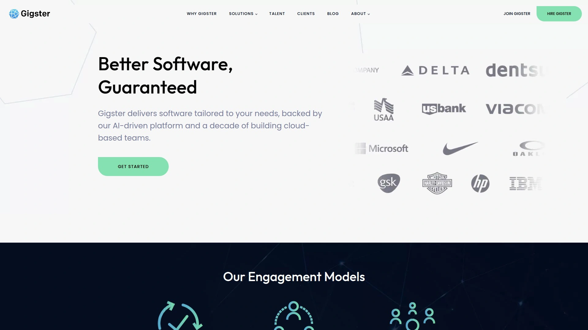

Gigster connects businesses with experienced software engineers and designers for complex digital projects requiring cross-functional expertise. The platform's designers typically work alongside developers on app interfaces, web platforms, and digital product experiences rather than standalone graphic design projects. You receive assigned project managers overseeing entire development lifecycles from concept through launch.

Pricing depends on project complexity, type, and timeline, typically running higher than pure design platforms due to the comprehensive service model. Gigster suits businesses outsourcing complete product development where design integrates tightly with technical implementation. The platform's network includes professionals from top tech companies, ensuring high caliber talent across all disciplines.

***

## **[Reedsy](https://reedsy.com)**

A creative marketplace connecting authors with book designers, editors, and publishing professionals specializing in literary projects.

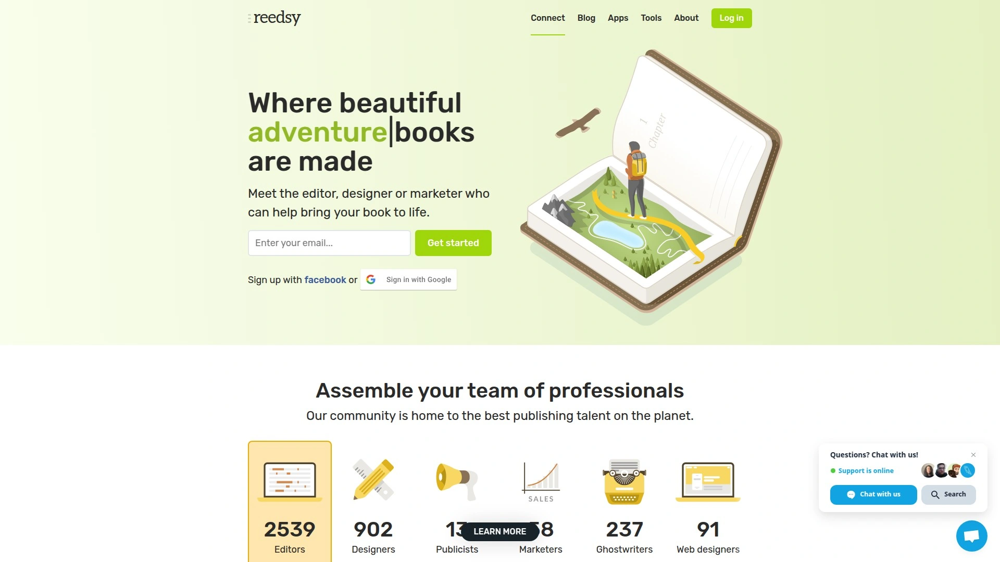

Reedsy serves the book publishing industry by hosting professionals who design book covers, format interiors, and create marketing materials for authors. Unlike general design platforms, Reedsy's designers specialize in publishing conventions, typography for long-form reading, and cover designs that work in both print and digital formats. You can browse designer portfolios showing previous book work, then request quotes for your project.

The platform vets all professionals before accepting them, ensuring quality standards across its network. Reedsy works through direct hiring rather than contests, fostering collaborative relationships between authors and designers throughout publishing processes. The marketplace also includes editors, marketers, and ghostwriters, making it a comprehensive resource for independent authors managing their own publishing.

***

## **[Expert360](https://expert360.com)**

An Australian consulting platform connecting businesses with senior independent consultants including strategic design specialists.

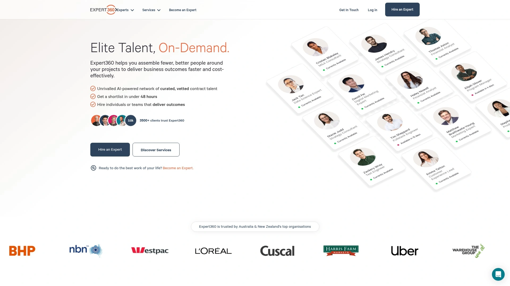

Expert360 focuses primarily on business consulting but includes creative strategy and design thinking professionals within its network. The platform suits larger organizations seeking experienced practitioners for strategic initiatives rather than execution-focused design work. Consultants on Expert360 typically come from top firms and corporate backgrounds, bringing strategic frameworks to creative challenges.

The service emphasizes quick matching to qualified experts, usually within 48 hours of project posting. Expert360 works best for design strategy, brand positioning, and creative leadership projects rather than producing actual design deliverables. Their consultants help define direction and frameworks that internal teams or other designers then execute.

***

## **[Catalant](https://catalant.com)**

A fit-to-purpose consulting network providing access to experienced business professionals including brand and design strategists.

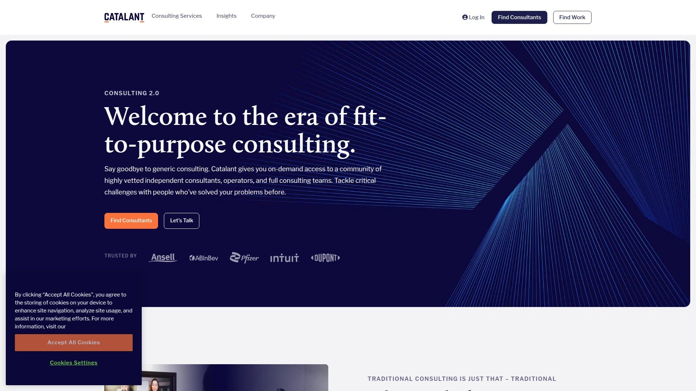

Catalant connects enterprises with independent consultants and small teams for strategic projects across business functions. The platform includes creative strategists and brand consultants who've solved similar challenges at major companies. Rather than producing designs, Catalant experts help define strategies, scope projects, and establish frameworks for creative initiatives.

The marketplace serves Fortune 500 companies and private equity firms needing flexible expertise without traditional consulting firm overhead. Projects typically involve strategic planning, transformation work, and advisory services rather than hands-on creative production. Catalant's rigorous vetting ensures all experts bring proven track records from respected organizations, commanding premium rates justified by their experience level.

***

## FAQ

**How do design contest platforms compare to hiring designers directly?**

Contest platforms generate multiple design directions quickly from diverse perspectives, giving you options to compare before committing. You only pay for the winning design while seeing dozens of concepts, whereas direct hiring means paying for a single designer's work regardless of whether you love the result. However, direct hiring builds ongoing relationships with designers who deeply understand your brand over time, producing more consistent work across multiple projects. Contests work best for one-off projects or when exploring different creative directions, while direct hiring suits ongoing design needs.

**What's the typical turnaround time for these platforms?**

Contest platforms like 99designs typically run for seven days, though you can expedite for additional fees. Subscription services like Design Pickle and Penji offer same-day to 48-hour turnarounds depending on package tier and project complexity. Freelance marketplaces like Fiverr and Upwork vary widely based on individual designer schedules, ranging from 24 hours to several weeks. AI-powered logo makers like Looka and BrandCrowd deliver instantly, with complete brand packages ready within hours.

**Which platform type offers the best value for small businesses?**

Budget-conscious businesses benefit most from contest platforms like Designhill, DesignCrowd, or Hatchwise where fixed contest fees generate multiple design options. AI logo makers like Looka and BrandCrowd provide professional results at the lowest price points, typically under $100 for complete packages. If you need ongoing design work monthly, subscription services like Design Pickle or Penji offer unlimited requests at flat rates, maximizing value for high-volume needs. The best choice depends on project frequency and complexity rather than a single "cheapest" option.

***

## Conclusion

The graphic design platform landscape offers solutions for every budget, timeline, and project type imaginable. From AI-powered instant logo generators to curated networks of elite creative consultants, you can now access professional design work that would've required agency relationships and substantial budgets just a decade ago. Whether you're launching a startup and need a complete brand identity by next week, or you're an established business seeking ongoing creative support, these 25 platforms eliminate the traditional barriers between ideas and polished visual execution.

For businesses wanting maximum creative options with predictable budgets, [99designs](https://99designs.com) remains the gold standard—its massive designer community and proven contest model consistently deliver diverse, high-quality concepts across every design category, making it the ideal starting point for any branding or creative project.
